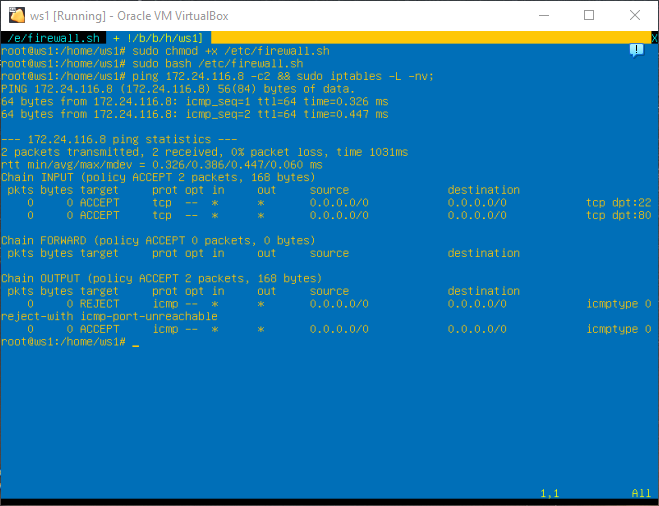
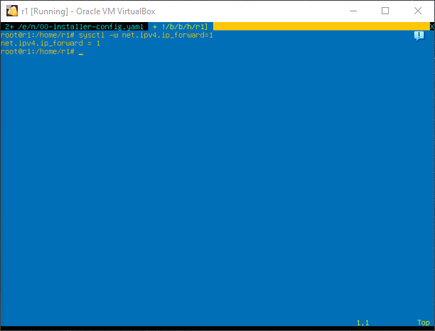
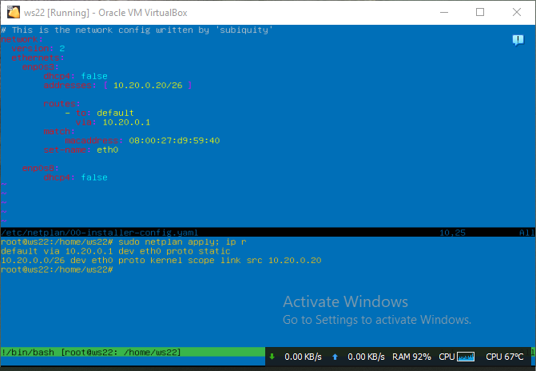

# Linux Network

-----------------------------------------------------
### Linux networks configuration on virtual machines.

# Part 1. ipcalc Tool
-----------------------------------------------------

## 1.1 Networks and Masks
- Network address of 192.167.38.54/13

### 2) Conversion of the mask

- Conversion of the mask 255.255.255.0 to prefix and binary.

-  /15 to normal and binary

-  11111111.11111111.11111111.11110000 to normal and prefix

### 3) Minimum and maximum host in 12.167.38.4 network with masks:

-  /8

- 11111111.11111111.00000000.00000000

- 255.255.254.0

- /4

## 1.2. localhost

### Define and write in the report whether an application running on localhost can be accessed with the following IPs:

#### Loopback - yes

- 194.34.23.100

- 127.0.0.2

- 127.1.0.1

- 128.0.0.1

## 1.3. Network ranges and segments

### Define and write in a report:

### 1) Which of the listed IPs can be used as public and which only as private

#### If have private -> YES

- 10.0.0.45      - PRIVATE
- 134.43.0.2     - PUBLIC
- 192.168.4.2    - PRIVATE
- 172.20.250.4   - PRIVATE
- 172.0.2.1      - PUBLIC
- 192.172.0.1    - PUBLIC
- 172.68.0.2     - PUBLIC
- 172.16.255.255 - PRIVATE
- 10.10.10.10    - PRIVATE
- 192.169.168.1  - PUBLIC

### 2)  Which of the listed gateway IP addresses are possible for 10.10.0.0/18 network:

The possible gateway IP addresses for the 10.10.0.0/18 network are:
- 10.10.0.1 or any IP address from the 10.10.0.1 to 10.10.63.254 range.

Therefore, the possible gateway IP addresses from the given list are:
- 10.10.0.2     - YES
- 10.10.10.10   - YES
- 10.10.100.1   - YES

- 10.0.0.1      - NO
- 10.10.1.255   - NO

# Part 2. Static routing between two machines
-----------------------------------------------------

## View existing network interfaces with the ip a command

##
###  Describe the network interface corresponding to the internal network on both machines and set the following addresses and masks: ws1 - 192.168.100.10, mask */16 *, ws2 - 172.24.116.8, mask /12 AND Run the netplan apply command to restart the network service

## 2.1. Adding a static route manually

Add a static route from one machine to another and back using a
ip r add command.

<b>Ping the connection between the machines And ping the connection between the machines</b>

## 2.2. Adding a static route with saving
### Add static route from one machine to another using etc/netplan/00-installer-config.yaml file

# Part 3. iperf3 utility
-----------------------------------------------------

## 3.1. Connection speed

8 Mbps to MB/s      - 1 MB/s\
100 MB/s to Kbps    - 800.000 (819.200)\
1 Gbps to Mbps      - 1000 (1024)

## 3.2. iperf3 utility

## Measure connection speed between ws1 and ws2

# Part 4. Network firewall
-----------------------------------------------------
## 4.1. iptables utility
### Create a /etc/firewall.sh file simulating the firewall on ws1 and ws2:

* Run the files on both machines with chmod +x /etc/firewall.sh and /etc/firewall.sh commands

> <b>Difference between strategies - first suitable rule met is going to be executed. Rules that are applied after are going to be ignored.</b>

## 4.2 nmap utility
#### Use ping command to find a machine which is not pinged, then use nmap utility to show that the machine host is up

# Part 5. Static network routing
#### Start five virtual machines (3 workstations (ws11, ws21, ws22) and 2 routers (r1, r2))
## 5.1. Configuration of machine addresses

#### Set up the machine configurations in etc/netplan/00-installer-config.yaml according to the network in the picture. And Restart the network service. If there are no errors, check that the machine address is correct with the ip -4 acommand. Also ping ws22 from ws21. Similarly ping r1 from ws11.

## 5.2. Enabling IP forwarding.
### To enable IP forwarding, run the following command on the routers:
sysctl -w net.ipv4.ip_forward=1.

#### Open /etc/sysctl.conf file and add the following line:

## 5.3. Default route configuration
### Here is an example of the `ip r' command output after adding a gateway:
    default via 10.10.0.1 dev eth0
    10.10.0.0/18 dev eth0 proto kernel scope link src 10.10.0.2

### Call ip r and show that a route is added to the routing table
- Add a screenshot of the etc/netplan/00-installer-config.yaml file to the report.

### Ping r2 router from ws11 and show on r2 that the ping is reaching. To do this, use the
> tcpdump -tn -i eth1

### command.

- Add screenshots with the call and output of the used commands to the report.

## 5.4. Adding static routes

#### Add static routes to r1 and r2 in configuration file. Here is an example for r1 route to 10.20.0.0/26:
> Add description to the end of the eth1 network interface:\
\- to: 10.20.0.0 \
   via: 10.100.0.12

#### Call ip r and show route tables on both routers. Here is an example of the r1 table:
> 10.100.0.0/16 dev eth1 proto kernel scope link src 10.100.0.11
10.20.0.0/26 via 10.100.0.12 dev eth1
10.10.0.0/18 dev eth0 proto kernel scope link src 10.10.0.1

* Add a screenshot with the call and output of the used command to the report.

#### Run ip r list 10.10.0.0/[netmask] and ip r list 0.0.0.0/0 commands on ws11.

* Add a screenshot with the call and the output of the used commands to the report.

* Explain in the report why a different route other than 0.0.0.0/0 had been selected for 10.10.0.0/[netmask] although it could be the default route.
> The default route is the route that the system administrator configures in the device and which will be used by the device if no matching entries in the routing table are found.

## 5.5. Making a router list

#### Here is an example of the traceroute utility output after adding a gateway:
> 1 10.10.0.1 0 ms 1 ms 0 ms \
2 10.100.0.12 1 ms 0 ms 1 ms \
3 10.20.0.10 12 ms 1 ms 3 ms

<b>Run the tcpdump -tnv -i eth0 dump command on r1</b>

Use <b>traceroute</b> utility to list routers in the path from ws11 to ws21

- Add a screenshots with the call and the output of the used commands (tcpdump and traceroute) to the report.

- Based on the output of the dump on r1, explain in the report how path construction works using traceroute.

> Each packet passes a certain number of nodes on its way until it reaches its goal. Moreover, each package has its own lifetime. This is the number of nodes that a packet can traverse before it is destroyed. This parameter is written in the TTL header, each router through which the packet will pass reduces it by one. When TTL=0, the packet is destroyed, and the Time Exceeded message is sent to the sender.
The traceroute command uses UDP packets. It sends a packet with TTL = 1 and looks at the address of the responding node, then TTL=2, TL=3 and so on until it reaches the target. Three packets are sent each time and the transit time is measured for each of them. The packet is sent to a random port, which is most likely not busy. When the traceroute utility receives a message from the target node that the port is unavailable, the trace is considered completed.

## 5.6. Using ICMP protocol in routing

#### Run on r1 network traffic capture going through eth0 with the
> tcpdump -n -i eth0 icmp command.

> ping -c 1 10.30.0.111 command.

- Add a screenshot with the call and the output of the used commands to the report.

# Part 6. Dynamic IP configuration using DHCP

For r2, configure the DHCP service in the /etc/dhcp/dhcpd.conf file:

1) specify the default router address, DNS-server and internal network address. Here is an example of a file for r2:
subnet 10.100.0.0 netmask 255.255.0.0 {}

> subnet 10.20.0.0 netmask 255.255.255.192 \
{ \
    range 10.20.0.2 10.20.0.50; \
    option routers 10.20.0.1; \
    option domain-name-servers 10.20.0.1; \
}

2) write nameserver 8.8.8.8. in a resolv.conf file

- Add screenshots of the changed files to the report.

#### Restart the DHCP service with systemctl restart isc-dhcp-server. Reboot the ws21 machine with reboot and show with ip a that it has got an address. Also ping ws22 from ws21.

- Add a screenshot with the call and the output of the used commands to the report.

#### Specify MAC address at ws11 by adding to etc/netplan/00-installer-config.yaml:
> macaddress: 10:10:10:10:10:BA, dhcp4: true

- Add a screenshot of the changed etc/netplan/00-installer-config.yaml file to the report.

#### Сonfigure r1 the same way as r2, but make the assignment of addresses strictly linked to the MAC-address (ws11). Run the same tests

- Describe this part in the report the same way as for r2.

#### Request ip address update from ws21

- Add screenshots of ip before and after update to the report
- Describe in the report what DHCP server options were used in this point.

#### ws21 before update

#### ws21 after update

> DHCP server options:\
dhclient -r - delete old\
dhclient -dev (interface)

> subnet 10.20.0.0 netmask 255.255.255.192\
{\
    range 10.20.0.2 10.20.0.50; - range of available IP addresses\
    option routers 10.20.0.1; - router gateway address\
    option domain-name-servers 10.20.0.1; IP address DNS-server\
}

# Part 7. NAT

#### In /etc/apache2/ports.conf file change the line Listen 80 to Listen 0.0.0.0:80on ws22 and r1, i.e. make the Apache2 server public

- Add a screenshot of the changed file to the report and

Start the Apache web server with service apache2 start command on ws22 and r1

- Add screenshots with the call and the output of the used command to the report.

#### Add the following rules to the firewall, created similarly to the firewall from Part 4, on r2:

1) Delete rules in the filter table - iptables -F

2) Delete rules in the "NAT" table - iptables -F -t nat

3) Drop all routed packets - iptables --policy FORWARD DROP

#### Run the file as in Part 4

#### Check connection between ws22 and r1 with the ping command When running the file with these rules, ws22 should not ping from r1

- Add screenshots with the call and the output of the used command to the report.

<i>When running the file with these rules, ws22 should ping from r1</i>

")

#### 4) allow routing of all ICMP protocol packets

Run the file as in Part 4

Check connection between ws22 and r1 with the ping command
When running the file with these rules, ws22 should ping from r1

- Add screenshots with the call and the output of the used command to the report.

#### Add two more rules to the file:

#### 5) Enable SNAT, which is masquerade all local ip from the local network behind r2 (as defined in Part 5 - network 10.20.0.0)

<i>Tip: it is worth thinking about routing internal packets as well as external packets with an established connection</i>

#### 6) enable DNAT on port 8080 of r2 machine and add external network access to the Apache web server running on ws22

<i>Tip: be aware that when you will try to connect, there will be a new tcp connection for ws22 and port 80</i>

Add a screenshot of the changed file to the report

Check the TCP connection for SNAT by connecting from ws22 to the Apache server on r1 with the telnet [address] [port] command

Check the TCP connection for DNAT by connecting from r1 to the Apache server on ws22 with the telnet command (address r2 and port 8080)

Add screenshots with the call and the output of the used commands to the report.

# Part 8. Bonus. Introduction to SSH Tunnels

#### Run a firewall on r2 with the rules from Part 7

#### Start the Apapche web server on ws22 on localhost only (i.e. in /etc/apache2/ports.conf file change the line Listen 80 to Listen localhost:80)

#### Use Local TCP forwarding from ws21 to ws22 to access the web server on ws22 from ws21

- ssh -L 8080:10.20.0.20:80 ws21@localhost

#### Use Remote TCP forwarding from ws11 to ws22 to access the web server on ws22 from ws11

#### To check if the connection worked in both of the previous steps, go to a second terminal (e.g. with the Alt + F2) and run the telnet 127.0.0.1 [local port] command.

#### ws21 to ws22 check connect telnet.

#### ws11 to ws22 check connect telnet.

